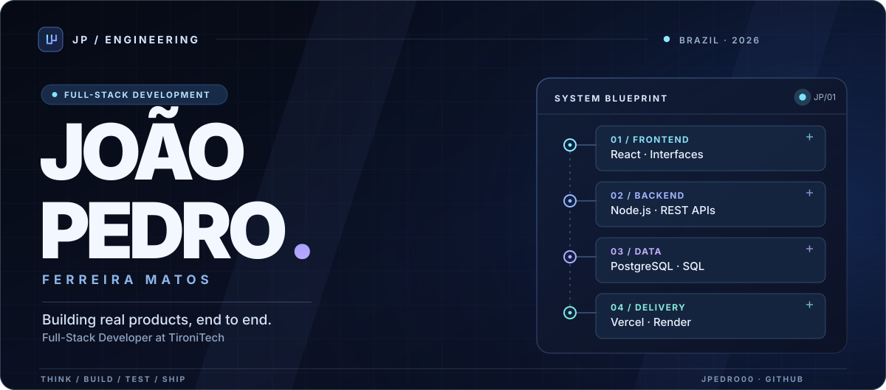

  

  <a href="https://www.linkedin.com/in/jo%C3%A3o-pedro-ferreira-matos-37ba8b348/">LinkedIn</a>
  &nbsp; / &nbsp;
  <a href="https://tironitech.com/">TironiTech</a>
  &nbsp; / &nbsp;
  <a href="https://github.com/jpedro00?tab=repositories">Repositories</a>

### What I do

I’m a **Full-Stack Developer at TironiTech** and an **Analysis and Systems Development student at FATEC Ourinhos**. I work across the development lifecycle — from frontend experiences and business logic to APIs, PostgreSQL, debugging, and deployment.

`React` · `JavaScript / TypeScript` · `Node.js` · `Express` · `PostgreSQL` · `REST APIs` · `Vercel` · `Render`

### Selected work

| Project | What it explores |
| :-- | :-- |
| **[Clube da Rifa](https://github.com/jpedro00/siteRIFAfront)** · [Backend](https://github.com/jpedro00/siteRIFAback) | Multi-app platform architecture, API contracts, authentication, and data boundaries. |
| **[SignGuard](https://github.com/jpedro00/SignGuard-SITE)** | Web product development and user-facing experiences. |
| **[TironiTech](https://github.com/jpedro00/tironitech)** | Corporate web experience and interface development. |

Interested in software that connects solid engineering to practical business problems.
