<!-- JP / Engineering · Premium animated profile -->

  

  <strong>Full-Stack Developer @ TironiTech</strong>
  &nbsp;·&nbsp; Software Engineering
  &nbsp;·&nbsp; FATEC Ourinhos

  <a href="https://www.linkedin.com/in/jo%C3%A3o-pedro-ferreira-matos-37ba8b348/">LinkedIn</a>
  &nbsp; • &nbsp;
  <a href="https://tironitech.com/">TironiTech</a>
  &nbsp; • &nbsp;
  <a href="https://github.com/jpedro00?tab=repositories">Projects</a>
  &nbsp; • &nbsp;
  <a href="https://portfolio-eosin-three-55.vercel.app/">Portfolio</a>

---

### The way I build

I’m a **Full-Stack Developer at TironiTech** and an **Analysis and Systems Development student at FATEC Ourinhos**. I work with real web products — turning business requirements into interfaces, APIs, database operations, integrations, and reliable releases.

I enjoy going beyond the UI: understanding **how the whole application fits together**, where data flows, how background jobs run, and what needs to happen for software to reach production.

### How I work — an iterative process

I approach software engineering as a **feedback-driven process**, not a rigid checklist. I start by understanding the problem and its constraints, validate the proposed direction, implement deliberately, test real behavior and revisit earlier decisions whenever the evidence calls for it.

  

Illustrated engineering approach, not a fixed sequence or a live progress tracker. The diagram uses SVG animations, with a reduced-motion fallback.

  
<b>Analyze & validate — understand before building</b>

   
  Investigate the problem, existing behavior, business requirements, constraints and edge cases. Define what success looks like and verify assumptions before committing to a solution.
    
  <code>Context → Requirements → Constraints → Feasibility → Validation</code>

  
<b>Implement & test — build with feedback</b>

   
  Work across the relevant frontend, backend, data or integration layers. Test the important paths, failure scenarios and regressions; revisit the implementation or the original assumptions when a test reveals something new.
    
  <code>Design ↔ Implementation ↔ Testing ↔ Refinement</code>

  
<b>Review & deliver — ship with care</b>

   
  Inspect the changes, review their scope, check configuration and compatibility, and prepare the release. Validate deployment behavior rather than treating a successful build as proof that everything works.
    
  <code>Review → Verify → Release → Validate</code>

  
<b>Monitor & improve — keep the loop open</b>

   
  Use logs, feedback and observed behavior to diagnose issues and identify the next improvement. Monitoring can lead back to analysis, validation, implementation or testing at any point.
    
  <code>Observe → Investigate → Learn → Iterate</code>

### Technologies I work with

| Layer | Tools & concepts |
| :-- | :-- |
| **Frontend** | React · JavaScript · TypeScript · HTML · CSS · Next.js |
| **Backend** | Node.js · Express · REST APIs · Authentication · Webhooks |
| **Data** | PostgreSQL · SQL · Supabase · Neon |
| **Delivery** | Git · GitHub · Vercel · Render · Debugging · Automated tests |
| **Integrations** | Payment flows · External APIs · Async jobs · Commercial systems |

### Selected projects

| Repository | What I work on |
| :-- | :-- |
| **[Clube da Rifa · Frontend](https://github.com/jpedro00/siteRIFAfront)** / **[Backend](https://github.com/jpedro00/siteRIFAback)** | Multi-app platform, API contracts, database boundaries, authentication, workers, and application architecture. |
| **[SignGuard](https://github.com/jpedro00/SignGuard-SITE)** | User-facing web product and interface development. |
| **[TironiTech website](https://github.com/jpedro00/tironitech)** | Corporate web experience, UI and interactive frontend. |
| **[Portfolio](https://github.com/jpedro00/PORTFOLIO_)** | Personal website and selected work. |

  
<b>More about my approach</b>

   
  <ul>
    <li><b>Understand the problem</b> before implementing the solution.</li>
    <li><b>Respect data boundaries</b> and keep authorization on the backend.</li>
    <li><b>Ship responsibly</b> with tests, clear changes and production awareness.</li>
    <li><b>Keep learning</b> by building, breaking, debugging and improving real systems.</li>
  </ul>

---

Think. Build. Test. Ship. Improve. &nbsp; / &nbsp; João Pedro Ferreira Matos

